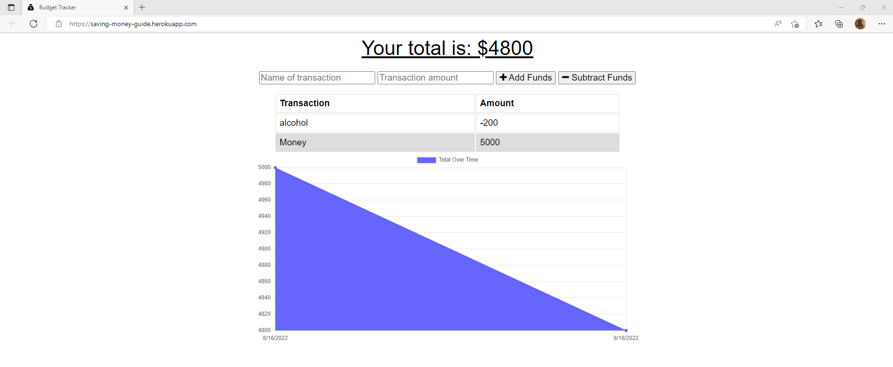

# Budget Tracker Starter Code

## Description 
The point of this application is to be able to add and subtract from your money to see how much you are spending and how much you have remaining.

## Table of Contents

* [Installation](#installation)
* [Usage](#usage)
* [Tests](#tests)
* [Questions](#questions)

## Installation 
To install this you have to clone the files from github to your machine and run npm install then run npm start
Or can utilize the live link and even go offline!

## Usage 
The user can use this to budget their money to hope to save money!

## License
This is licensed under Apache license can click badge to get more details

## Tests 
I would run the application each time I would update the code to make sure it was still functioning.

## Technologies used
* PWA
* mongoose
* Javascript
* express

## Live link
https://saving-money-guide.herokuapp.com/

## App Screenshot

## Questions
If you have any questions about this project you may reach me below at:   
gerushays@gmail.com 
Also you may check out my github link below at:  
https://github.com/GerusHays